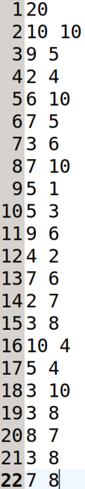
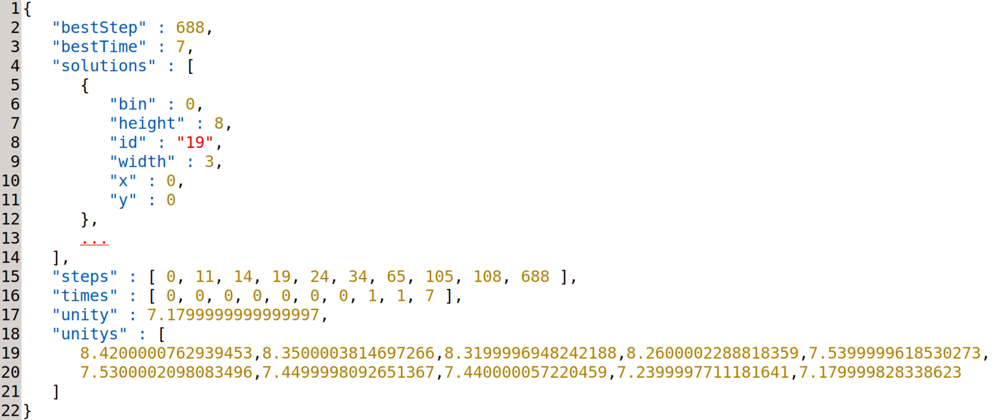

# Large neighborhood search for 2D bin packing problem

# The format of benchmark instances
Each *txt* file corresponds to an instance. The first line represents the number of boxes, while the second line represents the width and height of the bin. The remaining lines represent the width and height of each box.

# The format of results
Each JSON file represents the output result of an instance. This file contains not only the placement of each box but also the time required to obtain the optimal solution.

# File structure

## 2bp
This folder includes commonly used benchmarks for 2D-BPP, namely *bwmv*, *cgcut*, *gcut*, *ngcut*, and *beng*, including a total of 538 instances.

## 2bp-noR
This folder contains the results of our LNS method applied to the 538 benchmark instances when box rotations are not allowed.

## 2bp-R
This folder contains the results of our LNS method applied to the 538 benchmark instances when box rotations are allowed.

## largeScale

This folder includes a newly generated large-scale benchmark for 2D-BPP, consisting of 200 instances. The filenames are in the format of _i_j_k.txt_, where $i\in \{20,40,60,80,100\}$, $j\in \{10,35,60,85\}$, and $k\in \{0,\ldots,9\}$ represent the number of bins, the proportion of small boxes, and the instance index, respectively.

## LargeScale-R
This folder contains the results of our LNS method applied to the new large-scale benchmark instances when box rotations are allowed.
